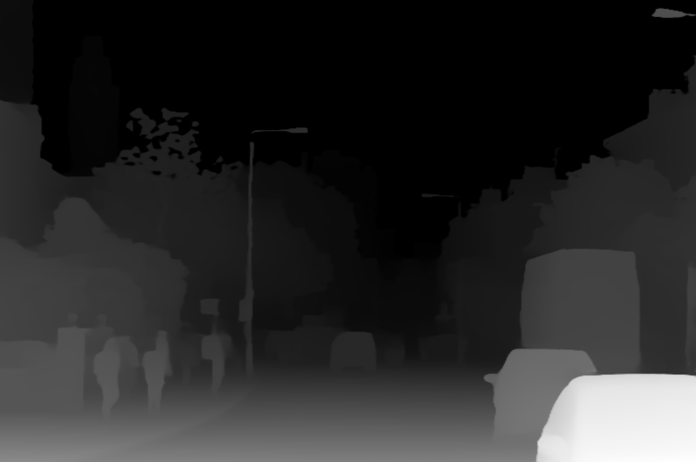

<div align="center">

# Depth-Anythingv2-TensorRT-python

[](https://www.python.org/downloads/release/python-388/)
[](https://developer.nvidia.com/cuda-11-4-0-download-archive)
[](https://developer.nvidia.com/tensorrt)

*: This repository is just for onnx2tensorrt of Depth Anything v2.
</div>

## Requirments

* python 3.8.8
* cuda 11.4
* tensorrt 8.5.2.2

*: About tensorrt, you can download it from [NVIDIA TensorRT](https://developer.nvidia.com/nvidia-tensorrt-8x-download), and then you can install it by the following command.


```shell
export LD_LIBRARY_PATH=/path/to/TensorRT-8.5.2.2/lib:$LD_LIBRARY_PATH
export PATH=$PATH:/path/to/TensorRT-8.5.2.2/bin
source ~/.bashrc
source /etc/profile

cd TensorRT-8.5.2.2/python
pip install tensorrt-8.2.5.1-cp38-none-linux_x86_64.whl

cd TensorRT-8.5.2.2/graphsurgeon
pip install graphsurgeon-0.4.5-py2.py3-none-any.whl

cd TensorRT-8.5.2.2/onnx_graphsurgeon
pip install onnx_graphsurgeon-0.3.12-py2.py3-none-any.whl
```


## Usage
Firsy, you can download the corresponding onnx model file into the checkpoints folder from [yuvraj108c/Depth-Anything-2-Onnx](https://huggingface.co/yuvraj108c/Depth-Anything-2-Onnx/tree/main).

Next, You can convert onnx model to tensorrt engine file for using the corresponding command. (Here is an example for depth_anything_v2_vits.onnx, if you want to use other model, you can change the model name in the command.)

*: The workspace is the maximum memory size that TensorRT can allocate for building an engine. The larger the workspace, the more memory TensorRT can use to optimize the engine, and the faster the inference speed will be. However, the larger the workspace, the more memory will be used, so you need to choose a suitable workspace size according to your own hardware configuration.


```bash
python tools/onnx2trt.py -o checkpoints/depth_anything_v2_vits.onnx --output depth_anything_v2_vits.engine --workspace 2
```


* The output would be a trt engine file.

Finally, you can infer the image with the engine file.

```bash
python models/dpt.py --img assets/demo01.jpg --engine checkpoints/depth_anything_v2_vits.engine --grayscale
```

When you run the command, you will see the following output:


* The output would be a image with the depth map.

## 👏 Acknowledgement

This project is based on the following projects:
- [Depth-Anything-v2](https://github.com/DepthAnything/Depth-Anything-V2) - Depth-Anything-V2-Small model.
- [TensorRT](https://github.com/NVIDIA/TensorRT/tree/release/8.6/samples) - TensorRT samples and api documentation.
- [yuvraj108c/Depth-Anything-2-Onnx](https://huggingface.co/yuvraj108c/Depth-Anything-2-Onnx/tree/main) - Depth-Anything-2-Onnx model.